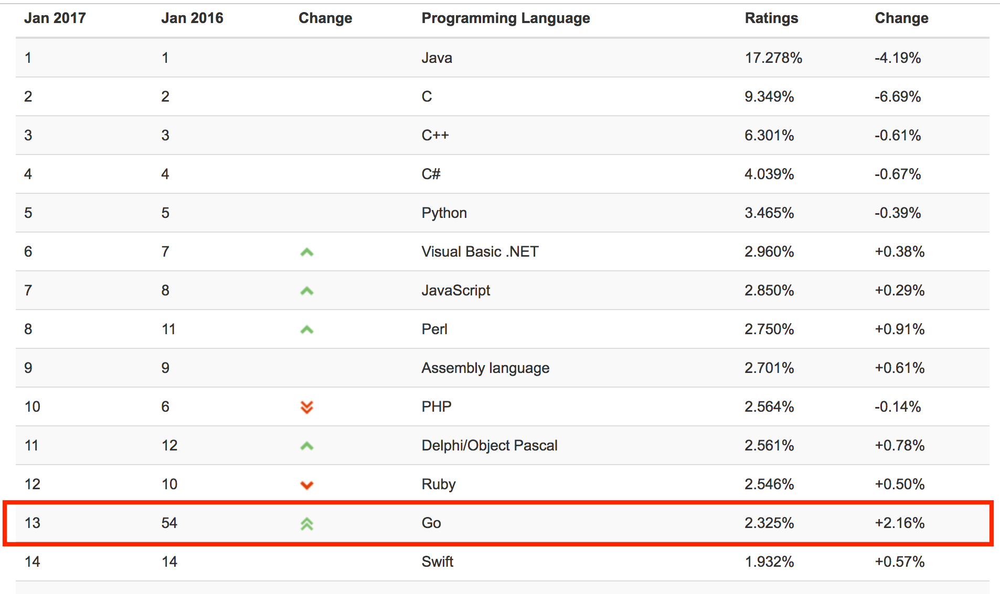

## Should I stay or should I Go?

Ralf Wirdemann - Software Coaching

Note:
Mein Name ist Ralf Wirdemann, das ist meine Firma "kommitment" und heute geht es um Go.

Kurz zu mir: Ich arbeite als Softwarecoach. Ich bring Teams methodisch und technisch auf Spur.

Dazu gehört auch: Auf der suche nach Technolgien zu sein.

---

<pre class="stretch"><code class="objective-c" data-trim data-noescape>
- (RACSignal *)getAllGroupsV2 {
   
    RACSignal *signal = [communicator get:@"http://picue.de/groups"];
    
	return [RACSignal createSignal:^RACDisposable *(id<RACSubscriber> subscriber) {
    
	    [signal subscribeNext:^(NSDictionary *data) {
            NSManagedObjectContext *context =
			    [PQCoreDataManager sharedManager].managedContext;
            [PQGroup createOrUpdateWithContext:context data:data];
    
	    } error:^(NSError *error){
            [subscriber sendError:error];
    
	    } completed:^{
            [[PQCoreDataManager sharedManager] saveContext];
            [subscriber sendCompleted];
        }];
        
		return nil;
    }];
}
</code></pre>

---

<pre class="stretch"><code class="go" data-trim data-noescape>
func getAllGroupsV2() {
	if resp, err := http.Get("http://picue.de/groups"); err != nil {
		panic(err)
	} else {
		var groups []domain.Group
		json := resp.Body
		decoder := json.NewDecoder(json)	
		decode.Decode(&groups)
		database.CreateGroups(groups)
	}
}
</code></pre>

---

# Lesbarkeit

Note:
- Go ist auf Lesbarkeit optimiert
- lt. Uncle Bob liegt das Verhältnis 10:1
- und wir lesen nicht nur unseren eigenen Code
- sondern unser Code wird auch von vielen anderen gelesen
- Leserbarkeit ist ein Schlüssel für produktive Teams

---

# <span style="color: green;">Block 1:</span> Überblick

---

# Geschichte

<p class="fragment" style="text-align: left;">2007: Frust Komplextität von Google-Software</p>

<ul style="list-style-type: square">
	<li class="fragment" style="text-align: left;">Komplexe Abhängigkeiten</li>
	<li class="fragment" style="text-align: left;">Langsame Builds</li>
	<li class="fragment" style="text-align: left;">Jeder nutzt unterschiedliche Subsets der Sprache</li>
	<li class="fragment" style="text-align: left;">Mangelnde Lesbarkeit</li>
	<li class="fragment" style="text-align: left;">Updates sind teuer</li>
</ul>

---


Note:
- Idee: Einfache, compilierbare Programmiersprache, die heutigen Rechensystemen gerecht wird

---


Note:
- Thomposon: Unix, erste Shell, UTF-8, Plan 9
- Rob Pike: Unix, Plan 9, UTF-8
- Griesemer: V8 JavaScript Engine, Java Hotspot VM
- 2009 erste öffentliche Version

---

## Statisch getypte

```
var i int

s := "Hallo"      // string
f := 3.142        // float

type struct Product {
    Id   int
    Name string
}

func foo(p Product) {
}

p := Product{1, "Schuhe"}

foo(p)
```
@[1]
@[3-4]
@[6-9]
@[11-12]

Note:
- Objekte haben Typ
- Sicherstellen, das z.B. Variablen, Funktionen korrekt verwendet werden
- Ziel: Vermeidung von Laufzeitfehlern
- Steht nicht im Weg:
  - vermeidet typischer Fehler der dynamischen Programmierung
  - steht aber nicht im Weg

---

### Cross Platform-Binaries


---

## Only 25 Keywords

<pre class="stretch"><code class="go">    
  break        default          var         interface       select 
  
  case         defer            go          map             struct 

  chan         else             goto        package         switch 

  const        fallthrough      if          range           type

  continue     for              import      return          func
</code></pre>

Note:
- Java hat 50
- Swift hat 58
- C++
- Spec ist 40 Seiten lang

---

## No fancy Stuff

<p class="fragment">Keine Enums</p>
<p class="fragment">Keine Generics</p>
<p class="fragment">Keine Optionals</p>
<p class="fragment">Keine Annotationen</p>
<p class="fragment">Kein protected</p>
<p class="fragment">Keine Exceptions</p>

---

# <span style="color: green;">Block 2:</span> Syntax


---

# Packages

---

<pre class="stretch"><code class="nohighlight" data-trim data-noescape>
<mark>$GOROOT/picue/domain/groups.go</mark>                   
                     media.go    
</code></pre>

Note:
- alle Dateien in einem Verzeichnis gehören zum selben Package
- Letzer Teil des Pfadnames
- ausnahme Main: Package muss main heissen, sonst wird die main Funktion nicht ausgeführt

---

<pre class="stretch"><code class="nohighlight" data-trim data-noescape>
$GOROOT/picue/<mark>domain/groups.go</mark>
                     media.go   

<mark>package domain</mark>

type Group struct {
...
}
</pre>

---

<pre class="stretch"><code class="nohighlight" data-trim data-noescape>
$GOROOT/picue/domain/groups.go                      
                     <mark>media.go</mark>

package domain

type Group struct {
...
}

<mark>package domain</mark>

type Media struct {
...
}
</pre>

---

# Functions

---

<pre class="stretch"><code class="nohighlight" data-trim data-noescape>
package main

<mark>func swap(x int, y int) (int, int) {</mark>
	return y, x
}

func main() {
	x, y := swap(2, 1)
}
</code></pre>

---

<pre class="stretch"><code class="nohighlight" data-trim data-noescape>
package main

func swap(x int, y int) (int, int) {
	return y, x
}

func main() {
	<mark>x, y := swap(2, 1)</mark>
}
</code></pre>

---

# Imports

---

<pre class="stretch"><code class="nohighlight" data-trim data-noescape>
package main

<mark>import "fmt"</mark>

func main() {
	fmt.Println("Hello")
}
</code></pre>

---

<pre class="stretch"><code class="nohighlight" data-trim data-noescape>
package main

import "fmt"

func main() {
	<mark>fmt.Println("Hello")</mark>
}
</code></pre>

---

# Variablen

---

<pre class="stretch"><code class="nohighlight" data-trim data-noescape>
package main

import "fmt"

<mark>var name string</mark>

func main() {
	name = "Jax"
	fmt.Println("Hello, ", name)
}
</code></pre>

---

<pre class="stretch"><code class="nohighlight" data-trim data-noescape>
package main

import "fmt"

func main() {
	<mark>name := "Jax"</mark>
	fmt.Println("Hello, ", name)
}
</code></pre>

---

# Typen

---

<pre class="stretch"><code class="nohighlight" data-trim data-noescape>
package main

import "fmt"

<mark>type message string</mark>

var m message

func main() {
	m = "Hello, Jax"
	fmt.Println(m)
}
</code></pre>

---

<pre class="stretch"><code class="nohighlight" data-trim data-noescape>
package main

import "fmt"

<mark>type greeting struct {</mark>
	message string
	greetee string
}

func main() {
	g := greeting{message: "Hello", greetee: "Jax"}
	fmt.Println(g.message, g.greetee)
}
</code></pre>

---

<pre class="stretch"><code class="nohighlight" data-trim data-noescape>
package main

import "fmt"

type greeting struct {
	message string
	greetee string
}

func main() {
	<mark>g := greeting{message: "Hello", greetee: "Jax"}</mark>
	fmt.Println(g.message, g.greetee)
}
</code></pre>

---

<pre class="stretch"><code class="nohighlight" data-trim data-noescape>
package main

import "fmt"

type greeting struct {
	message string
	greetee string
}

func main() {
	g := greeting{message: "Hello", greetee: "Jax"}
	fmt.Println(<mark>g.message</mark>, g.greetee)
}
</code></pre>

---

# Methods

---

<pre class="stretch"><code class="nohighlight" data-trim data-noescape>
package main

import "fmt"

type greeting struct {
	message string
	greetee string
}

<mark>func print(g greeting) {</mark>
	fmt.Println(g.message, g.greetee)
}

func main() {
	g := greeting{message: "Hello", greetee: "Jax"}
	print(g)
}
</code></pre>

---

<pre class="stretch"><code class="nohighlight" data-trim data-noescape>
package main

import "fmt"

type greeting struct {
	message string
	greetee string
}

func print(<mark>g greeting</mark>) {
	fmt.Println(g.message, g.greetee)
}

func main() {
	g := greeting{message: "Hello", greetee: "Jax"}
	print(g)
}
</code></pre>

---

<pre class="stretch"><code class="nohighlight" data-trim data-noescape>
package main

import "fmt"

type greeting struct {
	message string
	greetee string
}

func <mark>(g greeting)</mark> print() {
	fmt.Println(g.message, g.greetee)
}

func main() {
	g := greeting{message: "Hello", greetee: "Jax"}
	// print(g)
}
</code></pre>

---

<pre class="stretch"><code class="nohighlight" data-trim data-noescape>
package main

import "fmt"

type greeting struct {
	message string
	greetee string
}

func (g greeting) print() {
	fmt.Println(g.message, g.greetee)
}

func main() {
	<mark>g := greeting{message: "Hello", greetee: "Jax"}</mark>
	// print(g)
}
</code></pre>

---

<pre class="stretch"><code class="nohighlight" data-trim data-noescape>
package main

import "fmt"

type greeting struct {
	message string
	greetee string
}

func (g greeting) print() {
	fmt.Println(g.message, g.greetee)
}

func main() {
	g := greeting{message: "Hello", greetee: "Jax"}
	<mark>// print(g)</mark>
}
</code></pre>

---

<pre class="stretch"><code class="nohighlight" data-trim data-noescape>
package main

import "fmt"

type greeting struct {
	message string
	greetee string
}

func (g greeting) print() {
	fmt.Println(g.message, g.greetee)
}

func main() {
	g := greeting{message: "Hello", greetee: "Jax"}
	<mark>g.print()</mark>
}
</code></pre>

---

# Seiteneffekte

Note:
- Funktionen / Methode, die Zustand des Objektes / Parameter ändert 

---

<pre class="stretch"><code class="nohighlight" data-trim data-noescape>

package main

import "fmt"

type greeting struct {
	message      string
	greetee      string
	<mark>timesPrinted int</mark>
}

func (g greeting) print() {
	fmt.Println(g.message, g.greetee)
	g.timesPrinted++
}

func main() {
	g := greeting{message: "Hello", greetee: "Jax"}
	g.print()
	fmt.Printf("times printed: %d", g.timesPrinted)
}
</code></pre>

---

<pre class="stretch"><code class="nohighlight" data-trim data-noescape>
package main

import "fmt"

type greeting struct {
	message      string
	greetee      string
	timesPrinted int
}

func (g greeting) print() {
	fmt.Println(g.message, g.greetee)
	<mark>g.timesPrinted++</mark>
}

func main() {
	g := greeting{message: "Hello", greetee: "Jax"}
	g.print()
	fmt.Printf("times printed: %d", g.timesPrinted)
}
</code></pre>

---

<pre class="stretch"><code class="nohighlight" data-trim data-noescape>
package main

import "fmt"

type greeting struct {
	message      string
	greetee      string
	timesPrinted int
}

func (g greeting) print() {
	fmt.Println(g.message, g.greetee)
	g.timesPrinted++
}

func main() {
	g := greeting{message: "Hello", greetee: "Jax"}
	<mark>g.print()</mark>
	fmt.Printf("times printed: %d", g.timesPrinted)
}
</code></pre>

---

<pre class="stretch"><code class="nohighlight" data-trim data-noescape>
package main

import "fmt"

type greeting struct {
	message      string
	greetee      string
	timesPrinted int
}

func (g greeting) print() {
	fmt.Println(g.message, g.greetee)
	g.timesPrinted++
}

func main() {
	g := greeting{message: "Hello", greetee: "Jax"}
	g.print()
	<mark>fmt.Printf("times printed: %d", g.timesPrinted)</mark>
}
</code></pre>

---

<pre class="stretch"><code class="nohighlight" data-trim data-noescape>
package main

import "fmt"

type greeting struct {
	message      string
	greetee      string
	timesPrinted int
}

func (g greeting) print() {
	fmt.Println(g.message, g.greetee)
	g.timesPrinted++
}

func main() {
	g := greeting{message: "Hello", greetee: "Jax"}
	g.print()
	fmt.Printf("times printed: %d", g.timesPrinted) <mark> => 0</mark>
}
</code></pre>

---

# Pointer

---

<pre class="stretch"><code class="nohighlight" data-trim data-noescape>
package main

import "fmt"

func inc(px *int) {
	*px++
}

func main() {
	<mark>x := 1</mark>
	p := &x
	inc(p)
	fmt.Printf("x: %d", *p)
}
</code></pre>

---

<pre class="stretch"><code class="nohighlight" data-trim data-noescape>
package main

import "fmt"

func inc(px *int) {
	*px++
}

func main() {
	x := 1
	<mark>p := &x</mark>
	inc(p)
	fmt.Printf("x: %d", *p)
}
</code></pre>

---

<pre class="stretch"><code class="nohighlight" data-trim data-noescape>
package main

import "fmt"

func inc(px *int) {
	*px++
}

func main() {
	x := 1
	p := &x
	<mark>inc(p)</mark>
	fmt.Printf("x: %d", *p)
}
</code></pre>

---

<pre class="stretch"><code class="nohighlight" data-trim data-noescape>
package main

import "fmt"

<mark>func inc(px *int) {</mark>
	*px++
}

func main() {
	x := 1
	p := &x
	inc(p)
	fmt.Printf("x: %d", *p)
}
</code></pre>

---

<pre class="stretch"><code class="nohighlight" data-trim data-noescape>
package main

import "fmt"

func inc(px *int) {
	<mark>*px++</mark>
}

func main() {
	x := 1
	p := &x
	inc(p)
	fmt.Printf("x: %d", *p)
}
</code></pre>

---

<pre class="stretch"><code class="nohighlight" data-trim data-noescape>
package main

import "fmt"

func inc(px *int) {
	*px++
}

func main() {
	x := 1
	p := &x
	inc(p)
	fmt.Printf("x: %d", <mark>*p</mark>)
}
</code></pre>

---

<pre class="stretch"><code class="nohighlight" data-trim data-noescape>
package main

import "fmt"

func inc(px *int) {
	*px++
}

func main() {
	x := 1
	p := &x
	inc(p)
	fmt.Printf("x: %d", *p) <mark> => x: 2</mark>
}
</code></pre>

---

# Pointer Receiver

---

<pre class="stretch"><code class="nohighlight" data-trim data-noescape>
package main

import "fmt"

type greeting struct {
	message      string
	greetee      string
	timesPrinted int
}

func (g *greeting) print() {
	fmt.Println(g.message, g.greetee)
	g.timesPrinted++
}

func main() {
	<mark>g := &greeting{message: "Hello", greetee: "Jax"}</mark>
	g.print()
	fmt.Printf("times printed: %d", g.timesPrinted)
}
</code></pre>

---

<pre class="stretch"><code class="nohighlight" data-trim data-noescape>
package main

import "fmt"

type greeting struct {
	message      string
	greetee      string
	timesPrinted int
}

func (g *greeting) print() {
	fmt.Println(g.message, g.greetee)
	g.timesPrinted++
}

func main() {
	g := &greeting{message: "Hello", greetee: "Jax"}
	<mark>g.print()</mark>
	fmt.Printf("times printed: %d", g.timesPrinted)
}
</code></pre>

---

<pre class="stretch"><code class="nohighlight" data-trim data-noescape>
package main

import "fmt"

type greeting struct {
	message      string
	greetee      string
	timesPrinted int
}

<mark>func (g *greeting) print() {</mark>
	fmt.Println(g.message, g.greetee)
	g.timesPrinted++
}

func main() {
	g := &greeting{message: "Hello", greetee: "Jax"}
	g.print()
	fmt.Printf("times printed: %d", g.timesPrinted)
}
</code></pre>

---

<pre class="stretch"><code class="nohighlight" data-trim data-noescape>
package main

import "fmt"

type greeting struct {
	message      string
	greetee      string
	timesPrinted int
}

func (g *greeting) print() {
	fmt.Println(g.message, g.greetee)
	<mark>g.timesPrinted++</mark>
}

func main() {
	g := &greeting{message: "Hello", greetee: "Jax"}
	g.print()
	fmt.Printf("times printed: %d", g.timesPrinted)
}
</code></pre>

---

<pre class="stretch"><code class="nohighlight" data-trim data-noescape>
package main

import "fmt"

type greeting struct {
	message      string
	greetee      string
	timesPrinted int
}

func (g *greeting) print() {
	fmt.Println(g.message, g.greetee)
	g.timesPrinted++
}

func main() {
	g := &greeting{message: "Hello", greetee: "Jax"}
	g.print()
	<mark>fmt.Printf("times printed: %d", g.timesPrinted)</mark>
}
</code></pre>

---

<pre class="stretch"><code class="nohighlight" data-trim data-noescape>
package main

import "fmt"

type greeting struct {
	message      string
	greetee      string
	timesPrinted int
}

func (g *greeting) print() {
	fmt.Println(g.message, g.greetee)
	g.timesPrinted++
}

func main() {
	g := &greeting{message: "Hello", greetee: "Jax"}
	g.print()
	fmt.Printf("times printed: %d", g.timesPrinted) <mark>=> 1</mark>
}
</code></pre>

Note:
- Pointer ermögliche Immutability 
- Warum ist Immutability wichtig?
  - weniger Fehleranfällig, da keine ungewollten Seiteneffekte
- Funktionen mit Seiteneffekten sind als solche gekennzeichnet
- In anderen Programmiersprachen muss ich Seiteneffekte verhindern
- In Go muss ich Seiteneffekte zulassen

---

# Interfaces

---

<pre class="stretch"><code class="nohighlight" data-trim data-noescape>
<mark>type Printable interface {</mark>
	print() string
}

type greeting struct {
	message      string
	greetee      string
}

func (g *greeting) print() string {
	return fmt.Sprintf("", g.message, g.greetee)
}

func printOnConsole(printable Printable)  {
	fmt.Printf("=> %s", printable.print());
}

func main() {
	g := &greeting{message: "Hello", greetee: "Jax"}
	printOnConsole(g)
}
</code></pre>

---

<pre class="stretch"><code class="nohighlight" data-trim data-noescape>
type Printable interface {
	<mark>print() string</mark>
}

type greeting struct {
	message      string
	greetee      string
}

func (g *greeting) print() string {
	return fmt.Sprintf("", g.message, g.greetee)
}

func printOnConsole(printable Printable)  {
	fmt.Printf("=> %s", printable.print());
}

func main() {
	g := &greeting{message: "Hello", greetee: "Jax"}
	printOnConsole(g)
}
</code></pre>

---

<pre class="stretch"><code class="nohighlight" data-trim data-noescape>
type Printable interface {
	print() string
}

<mark>type greeting struct {</mark>
	message      string
	greetee      string
}

func (g *greeting) print() string {
	return fmt.Sprintf("", g.message, g.greetee)
}

func printOnConsole(printable Printable)  {
	fmt.Printf("=> %s", printable.print());
}

func main() {
	g := &greeting{message: "Hello", greetee: "Jax"}
	printOnConsole(g)
}
</code></pre>

---

<pre class="stretch"><code class="nohighlight" data-trim data-noescape>
type Printable interface {
	print() string
}

type greeting struct {
	message      string
	greetee      string
}

<mark>func (g *greeting) print() string {</mark>
	return fmt.Sprintf("", g.message, g.greetee)
}

func printOnConsole(printable Printable)  {
	fmt.Printf("=> %s", printable.print())
}

func main() {
	g := &greeting{message: "Hello", greetee: "Jax"}
	printOnConsole(g)
}
</code></pre>

---

<pre class="stretch"><code class="nohighlight" data-trim data-noescape>
type Printable interface {
	print() string
}

type greeting struct {
	message      string
	greetee      string
}

func (g *greeting) print() string {
	return fmt.Sprintf("", g.message, g.greetee)
}

<mark>func printOnConsole(printable Printable)  {</mark>
	fmt.Printf("=> %s", printable.print())
}

func main() {
	g := &greeting{message: "Hello", greetee: "Jax"}
	printOnConsole(g)
}
</code></pre>

---

<pre class="stretch"><code class="nohighlight" data-trim data-noescape>
type Printable interface {
	print() string
}

type greeting struct {
	message      string
	greetee      string
}

func (g *greeting) print() string {
	return fmt.Sprintf("", g.message, g.greetee)
}

func printOnConsole(printable Printable)  {
	fmt.Printf("=> %s", <mark>printable.print()</mark>)
}

func main() {
	g := &greeting{message: "Hello", greetee: "Jax"}
	printOnConsole(g)
}
</code></pre>

Note:
- Typ erfüllt Interface, wenn er alle Methoden implementiert
- Typ muss Interface nicht deklarierern

---

<pre class="stretch"><code class="nohighlight" data-trim data-noescape>
type Printable interface {
	print() string
}

type greeting struct {
	message      string
	greetee      string
}

func (g *greeting) print() string {
	return fmt.Sprintf("", g.message, g.greetee)
}

func printOnConsole(printable Printable)  {
	fmt.Printf("=> %s", printable.print());
}

func main() {
	<mark>g := &greeting{message: "Hello", greetee: "Jax"}</mark>
	printOnConsole(g)
}
</code></pre>

---

<pre class="stretch"><code class="nohighlight" data-trim data-noescape>
type Printable interface {
	print() string
}

type greeting struct {
	message      string
	greetee      string
}

func (g *greeting) print() string {
	return fmt.Sprintf("", g.message, g.greetee)
}

func printOnConsole(printable Printable)  {
	fmt.Printf("=> %s", printable.print());
}

func main() {
	g := &greeting{message: "Hello", greetee: "Jax"}
	<mark>printOnConsole(g)</mark>
}
</code></pre>

---

# Go auf einer Seite

---

<pre class="stretch"><code class="nohighlight" data-trim data-noescape>
<mark>package main</mark>
import "fmt"

type Dog struct {
	name        string
	timesBarked int
}

type Animal interface { bark() }

func (d *Dog) bark() {
	fmt.Printf("I am %s", d.name)
	d.timesBarked++
}

func sayHello(animal Animal) {
	animal.bark()
}

func main() {
	kalle := &Dog{name: "Kalle"}
	sayHello(kalle)
}
</code></pre>

---

<pre class="stretch"><code class="nohighlight" data-trim data-noescape>
package main
<mark>import "fmt"</mark>

type Dog struct {
	name        string
	timesBarked int
}

type Animal interface { bark() }

func (d *Dog) bark() {
	fmt.Printf("I am %s", d.name)
	d.timesBarked++
}

func sayHello(animal Animal) {
	animal.bark()
}

func main() {
	kalle := &Dog{name: "Kalle"}
	sayHello(kalle)
}
</code></pre>

---

<pre class="stretch"><code class="nohighlight" data-trim data-noescape>
package main
import "fmt"

<mark>type Dog struct {</mark>
	name        string
	timesBarked int
}

type Animal interface { bark() }

func (d *Dog) bark() {
	fmt.Printf("I am %s", d.name)
	d.timesBarked++
}

func sayHello(animal Animal) {
	animal.bark()
}

func main() {
	kalle := &Dog{name: "Kalle"}
	sayHello(kalle)
}
</code></pre>

---

<pre class="stretch"><code class="nohighlight" data-trim data-noescape>
package main
import "fmt"

type Dog struct {
	name        string
	timesBarked int
}

<mark>type Animal interface { bark() }</mark>

func (d *Dog) bark() {
	fmt.Printf("I am %s", d.name)
	d.timesBarked++
}

func sayHello(animal Animal) {
	animal.bark()
}

func main() {
	kalle := &Dog{name: "Kalle"}
	sayHello(kalle)
}
</code></pre>

---

<pre class="stretch"><code class="nohighlight" data-trim data-noescape>
package main
import "fmt"

type Dog struct {
	name        string
	timesBarked int
}

type Animal interface { bark() }

<mark>func (d *Dog) bark() {</mark>
	fmt.Printf("I am %s", d.name)
	d.timesBarked++
}

func sayHello(animal Animal) {
	animal.bark()
}

func main() {
	kalle := &Dog{name: "Kalle"}
	sayHello(kalle)
}
</code></pre>

---

<pre class="stretch"><code class="nohighlight" data-trim data-noescape>
package main
import "fmt"

type Dog struct {
	name        string
	timesBarked int
}

type Animal interface { bark() }

func (d *Dog) bark() {
	fmt.Printf("I am %s", d.name)
	d.timesBarked++
}

<mark>func sayHello(animal Animal) {</mark>
	animal.bark()
}

func main() {
	kalle := &Dog{name: "Kalle"}
	sayHello(kalle)
}
</code></pre>

---

<pre class="stretch"><code class="nohighlight" data-trim data-noescape>
package main
import "fmt"

type Dog struct {
	name        string
	timesBarked int
}

type Animal interface { bark() }

func (d *Dog) bark() {
	fmt.Printf("I am %s", d.name)
	d.timesBarked++
}

func sayHello(animal Animal) {
	animal.bark()
}

func main() {
	<mark>kalle := &Dog{name: "Kalle"}</mark>
	sayHello(kalle)
}
</code></pre>

---

## <span style="color: green;">Block 3:</span> Eigenschaften

<p class="fragment">Objektorientierte Programmierung</p>
<p class="fragment">Funktionale Programmierung</p>
<p class="fragment">Concurrency</p>

---

# Kapselung

---

<pre class="stretch"><code class="nohighlight" data-trim data-noescape>
<mark>package a</mark>

var x int
var X int

type s struct {}
type S struct {}

func foo() {
	...
}

func Foo() {
	...
}
</code></pre>

---

<pre class="stretch"><code class="nohighlight" data-trim data-noescape>
package a

<mark>var x int</mark>
var X int

type s struct {}
type S struct {}

func foo() {
	...
}

func Foo() {
	...
}
</code></pre>

---

<pre class="stretch"><code class="nohighlight" data-trim data-noescape>
package a

var x int
<mark>var X int</mark>

type s struct {}
type S struct {}

func foo() {
	...
}

func Foo() {
	...
}
</code></pre>

---

<pre class="stretch"><code class="nohighlight" data-trim data-noescape>
package a

var x int
var X int

<mark>type s struct {}</mark>
type S struct {}

func foo() {
	...
}

func Foo() {
	...
}
</code></pre>

---

<pre class="stretch"><code class="nohighlight" data-trim data-noescape>
package a

var x int
var X int

type s struct {}
<mark>type S struct {}</mark>

func foo() {
	...
}

func Foo() {
	...
}
</code></pre>

---

<pre class="stretch"><code class="nohighlight" data-trim data-noescape>
package a

var x int
var X int

type s struct {}
type S struct {}

<mark>func foo() {</mark>
	...
}

func Foo() {
	...
}
</code></pre>

---

<pre class="stretch"><code class="nohighlight" data-trim data-noescape>
package a

var x int
var X int

type s struct {}
type S struct {}

func foo() {
	...
}

<mark>func Foo()</mark> {
	...
}
</code></pre>

---

# Vererbung

Note:
- als ich mit OO angefangen habe, war Vererbung der neue heisse Scheiss

---

## Java

<pre class="stretch"><code class="nohighlight" data-trim data-noescape>
public class A {

    public void print() {
        ...
    }
}

public class B extends A {
}

B b = new B();
b.print();
</code></pre>

---

## Go
<pre class="stretch"><code class="nohighlight" data-trim data-noescape>
<mark>type A struct {</mark>
	Count int
}

type B struct {
	A
}

func (a A) print() {
    ...
}

b := B{}
b.print()  // Not allowed in Java
b.Count = 12
</code></pre>

---

## Go
<pre class="stretch"><code class="nohighlight" data-trim data-noescape>
type A struct {
	Count int
}

<mark>type B struct {</mark>
	A
}

func (a A) print() {
    ...
}

b := B{}
b.print()  // Not allowed in Java
b.Count = 12
</code></pre>

---

## Go
<pre class="stretch"><code class="nohighlight" data-trim data-noescape>
type A struct {
	Count int
}

type B struct {
	<mark>A</mark>
}

func (a A) print() {
    ...
}

b := B{}
b.print()  // Not allowed in Java
b.Count = 12
</code></pre>

---

## Go
<pre class="stretch"><code class="nohighlight" data-trim data-noescape>
type A struct {
	Count int
}

type B struct {
	A
}

<mark>func (a A) print() {</mark>
    ...
}

b := B{}
b.print()  // Not allowed in Java
b.Count = 12  
</code></pre>

---

## Go
<pre class="stretch"><code class="nohighlight" data-trim data-noescape>
type A struct {
	Count int
}

type B struct {
	A
}

func (a A) print() {
    ...
}

<mark>b := B{}</mark>
b.print()  // Not allowed in Java
b.Count = 12
</code></pre>

---

## Go
<pre class="stretch"><code class="nohighlight" data-trim data-noescape>
type A struct {
	Count int
}

type B struct {
	A
}

func (a A) print() {
    ...
}

b := B{}
<mark>b.print()</mark>  // Not allowed in Java
b.Count = 12
</code></pre>

---

## Go
<pre class="stretch"><code class="nohighlight" data-trim data-noescape>
type A struct {
	Count int
}

type B struct {
	A
}

func (a A) print() {
    ...
}

b := B{}
b.print()  // Not allowed in Java
<mark>b.Count = 12</mark>
</code></pre>

Note:
- Eher Komposition als Vererbung
- Pike: If C++ and Java are about type hierarchies and the taxonomy of types, Go is about composition.
- Effective Java: Favor composition over inheritance
- Vererbung ist die engste Form der Kopplung: Änderungen in der Basisklasse wirken sich direkt auf meine Klasse aus.

---

# Polymorphismus

---

## Java
<pre class="stretch"><code class="nohighlight" data-trim data-noescape>
public class A {

    public void print() {
        ...
    }
}

public class B extends A {
}

List&lt;A> l = new ArrayList<>();
l.add(new B());
</code></pre>

---

## Go
<pre class="stretch"><code class="nohighlight" data-trim data-noescape>
<mark>type A struct {</mark>
	a int
}

type B struct {
	A
}

list := [2]A{}
list[0] = A{}
list[1] = B{} // doesn't compile
</code></pre>

---

## Go
<pre class="stretch"><code class="nohighlight" data-trim data-noescape>
type A struct {
	a int
}

<mark>type B struct {</mark>
	A
}

list := [2]A{}
list[0] = A{}
list[1] = B{} // doesn't compile
</code></pre>

---

## Go
<pre class="stretch"><code class="nohighlight" data-trim data-noescape>
type A struct {
	a int
}

type B struct {
	A
}

<mark>list := [2]A{}</mark>
list[0] = A{}
list[1] = B{} // doesn't compile
</code></pre>

---

## Go
<pre class="stretch"><code class="nohighlight" data-trim data-noescape>
type A struct {
	a int
}

type B struct {
	A
}

list := [2]A{}
<mark>list[0] = A{}</mark>
list[1] = B{} // doesn't compile
</code></pre>

---

## Go
<pre class="stretch"><code class="nohighlight" data-trim data-noescape>
type A struct {
	a int
}

type B struct {
	A
}

list := [2]A{}
list[0] = A{}
<mark>list[1] = B{}</mark> // doesn't compile
</code></pre>

---

## Polymorphismus via Interfaces

---

<pre class="stretch"><code class="nohighlight" data-trim data-noescape>
<mark>type Animal interface</mark> {
	Talk() string
}

...

kalle := Dog{"Kalle"}
felix := Cat{"Felix"}

animals := [2]Animal{kalle, felix}
for _, v := range animals {
    fmt.Printf("Hey, %s\n", v.Talk())
}
</code></pre>

---

<pre class="stretch"><code class="nohighlight" data-trim data-noescape>
type Animal interface {
	Talk() string
}

...

<mark>kalle := Dog{"Kalle"}</mark>
felix := Cat{"Felix"}

animals := [2]Animal{kalle, felix}
for _, v := range animals {
    fmt.Printf("Hey, %s\n", v.Talk())
}
</code></pre>

---

<pre class="stretch"><code class="nohighlight" data-trim data-noescape>
type Animal interface {
	Talk() string
}

...

kalle := Dog{"Kalle"}
<mark>felix := Cat{"Felix"}</mark>

animals := [2]Animal{kalle, felix}
for _, v := range animals {
    fmt.Printf("Hey, %s\n", v.Talk())
}
</code></pre>

---

<pre class="stretch"><code class="nohighlight" data-trim data-noescape>
type Animal interface {
	Talk() string
}

...

kalle := Dog{"Kalle"}
felix := Cat{"Felix"}

<mark>animals := [2]Animal{kalle, felix}</mark>
for _, v := range animals {
    fmt.Printf("Hey, %s\n", v.Talk())
}
</code></pre>

---

<pre class="stretch"><code class="nohighlight" data-trim data-noescape>
type Animal interface {
	Talk() string
}

...

kalle := Dog{"Kalle"}
felix := Cat{"Felix"}

animals := [2]Animal{kalle, felix}
<mark>for _, v := range animals {</mark>
    fmt.Printf("Hey, %s\n", v.Talk())
}
</code></pre>

---

<pre class="stretch"><code class="nohighlight" data-trim data-noescape>
type Animal interface {
	Talk() string
}

...

kalle := Dog{"Kalle"}
felix := Cat{"Felix"}

animals := [2]Animal{kalle, felix}
for _, v := range animals {
    fmt.Printf("Hey, %s\n", <mark>v.Talk()</mark>)
}
</code></pre>

Note:
- Interfaces definieren Methoden, die von Typen implementiert werden
- no implements
- Typesafe Ducktyping
- ich kann nachträglich Interfaces deklatieren, ohne den Typ anzufassen

---

## Funktionale Programierung

<p class="fragment">Immutability</p>
<p class="fragment">Seiteneffektfreiheit</p>
<p class="fragment">Funktionen sind First Class-Objekte</p>

Note:
- Multi-Paradigmen Programmiersprache
- Pointer in Go adressieren die ersten beiden Punkte

---

<pre class="stretch"><code class="nohighlight" data-trim data-noescape>
func main() {
	<mark>f := func(x int) int {</mark>
		return x * x
	}
	result := f(2)
	print(result)
}
</code></pre>

---

<pre class="stretch"><code class="nohighlight" data-trim data-noescape>
func main() {
	f := func(x int) int {
		return x * x
	}
	<mark>result := f(2)</mark>
	print(result)
}
</code></pre>

---

<pre class="stretch"><code class="nohighlight" data-trim data-noescape>
func foo(<mark>fn func(x int) int</mark>) int {
	return fn(2)
}

func main() {
	f := func(x int) int {
		return x * x
	}
	result := foo(f)
	print(result)
}
</code></pre>

---

<pre class="stretch"><code class="nohighlight" data-trim data-noescape>
func foo(fn func(x int) int) int {
	<mark>return fn(2)</mark>
}

func main() {
	f := func(x int) int {
		return x * x
	}
	result := foo(f)
	print(result)
}
</code></pre>

---

<pre class="stretch"><code class="nohighlight" data-trim data-noescape>
<mark>type myfunction func(x int) int</mark>

func foo(fn myfunction) int {
	return fn(2)
}

func main() {
	f := func(x int) int {
		return x * x
	}
	result := foo(f)
	print(result)
}
</code></pre>

---

<pre class="stretch"><code class="nohighlight" data-trim data-noescape>
type myfunction func(x int) int

func foo(<mark>fn myfunction</mark>) int {
	return fn(2)
}

func main() {
	f := func(x int) int {
		return x * x
	}
	result := foo(f)
	print(result)
}
</code></pre>

---

# Concurrency

Note:
Programmiersprache, die heuten Rechensystem gerecht wird

---

<pre class="stretch"><code class="nohighlight" data-trim data-noescape>
<mark>func sum(s []int) int {</mark>
	sum := 0
	for _, v := range s {
		sum += v
	}
	return sum
}

println("sum: ", sum(values)) // sum:  124999999750000000
</code></pre>

---

<pre class="stretch"><code class="nohighlight" data-trim data-noescape>
func sum(s []int) int {
	sum := 0
	for _, v := range s {
		sum += v
	}
	return sum
}

<mark>println("sum: ", sum(values))</mark> // sum:  124999999750000000
</code></pre>

---

<pre class="stretch"><code class="nohighlight" data-trim data-noescape>
func sum(s []int) int {
	sum := 0
	for _, v := range s {
		sum += v
	}
	return sum
}

<mark>s1 := sum(values[0:size/2-1])</mark>
s2 := sum(values[size/2-1:])
println("sum: ", s1 + s2)    // sum: 124999999750000000 
</code></pre>

---

<pre class="stretch"><code class="nohighlight" data-trim data-noescape>
func sum(s []int) int {
	sum := 0
	for _, v := range s {
		sum += v
	}
	return sum
}

s1 := sum(values[0:size/2-1])
<mark>s2 := sum(values[size/2-1:])</mark>
println("sum: ", s1 + s2)    // sum: 124999999750000000 
</code></pre>

---

<pre class="stretch"><code class="nohighlight" data-trim data-noescape>
func sum(s []int) int {
	sum := 0
	for _, v := range s {
		sum += v
	}
	return sum
}

s1 := sum(values[0:size/2-1])
s2 := sum(values[size/2-1:])
println("sum: ", <mark>s1 + s2</mark>)    // sum: 124999999750000000 
</code></pre>

---

<pre class="stretch"><code class="nohighlight" data-trim data-noescape>
func sum(s []int, c chan int) {
	sum := 0
	for _, v := range s {
		sum += v
	}
	c <- sum                  // send result to channel
}

c := make(chan int)
<mark>go</mark> sum(values[0:size/2-1], c)
go sum(values[size/2-1:], c)
s1, s2 := <-c, <-c            // receive value from channel
println("sum: ", s1 + s2)     // sum: 124999999750000000 
</code></pre>

---

<pre class="stretch"><code class="nohighlight" data-trim data-noescape>
func sum(s []int, c chan int) {
	sum := 0
	for _, v := range s {
		sum += v
	}
	c <- sum                  // send result to channel
}

<mark>c := make(chan int)</mark>
go sum(values[0:size/2-1], c)
go sum(values[size/2-1:], c)
s1, s2 := <-c, <-c            // receive value from channel
println("sum: ", s1 + s2)     // sum: 124999999750000000 
</code></pre>

---

<pre class="stretch"><code class="nohighlight" data-trim data-noescape>
func sum(s []int, c chan int) {
	sum := 0
	for _, v := range s {
		sum += v
	}
	c <- sum                  // send result to channel
}

c := make(chan int)
go sum(values[0:size/2-1], <mark>c</mark>)
go sum(values[size/2-1:], c)
s1, s2 := <-c, <-c            // receive value from channel
println("sum: ", s1 + s2)     // sum: 124999999750000000 
</code></pre>

---

<pre class="stretch"><code class="nohighlight" data-trim data-noescape>
func sum(s []int, c chan int) {
	sum := 0
	for _, v := range s {
		sum += v
	}
	<mark>c <- sum</mark>                  // send result to channel
}

c := make(chan int)
go sum(values[0:size/2-1], c)
go sum(values[size/2-1:], c)
s1, s2 := <-c, <-c            // receive value from channel
println("sum: ", s1 + s2)     // sum: 124999999750000000 
</code></pre>

---

<pre class="stretch"><code class="nohighlight" data-trim data-noescape>
func sum(s []int, c chan int) {
	sum := 0
	for _, v := range s {
		sum += v
	}
	c <- sum                  // send result to channel
}

c := make(chan int)
go sum(values[0:size/2-1], c)
go sum(values[size/2-1:], c)
<mark>s1, s2 := <-c, <-c</mark>            // receive value from channel
println("sum: ", s1 + s2)     // sum: 124999999750000000 
</code></pre>

Note:
- Go-Runtine erzeugt Threads
- Threads führen Go-Routinen aus
- leichtgewichtige Abstraktionen von Threads

---

# Zusammenfassung

<p class="fragment">Kapselung über Packages</p>
<p class="fragment">Komposition statt Vererbung</p>
<p class="fragment">Interfaces</p>
<p class="fragment">Polymorphismus</p>
<p class="fragment">Funktionale Programmierung</p>
<p class="fragment">Go-Routinen für Nebenläufigkeit</p>

---

## <span style="color: green;">Block 4:</span> Wer, wofür, warum?

---


<small>Quelle: https://www.tiobe.com/tiobe-index/</small>

---



<small>Quelle: https://www.tiobe.com/tiobe-index/</small>

---


<small>Quelle: https://github.com/golang/go/wiki/GoUsers</small>

Note:
- Google
  - Kubernetes (Container Orchestrierung)
- Wunderlist
  - Rails Monotlith, heute Microservices
    - Many connections when to Devices online gehen
    - Performance and Scalability
    - Warum Go?
      - Easy to learn (watching one talk)
      - Concurrency, Deployment, No external Dependency
      - close c performance
- Dropbox: Performance critical parts from Python to go
  - 15 Go Teams
  - 1.3 Millionen LOC Go

---

# Wofür Go?

---


<small>Quelle: https://blog.golang.org/survey2016-results</small>

Note:
- März 2017 Go 2016 Survey Results
- 3500 Entwickler: 60% Web, 35% DevOps
- CLI: Go-Tools, DevOps-Tools
- Alles was im Hintergrund läuft, dabei robust und schnell sein muss
  - Dropbox: Bandbreitenregulierung
  - Edgestore: Verteilte Datenbank
  - Blockchain

---

# Warum Go? 

---

# Produktivität

<p class="fragment">Erlernbarkeit</p>
<p class="fragment">Standards und Konventionen</p>
<p class="fragment">Lesbarkeit</p>
<p class="fragment">Sprachstabil</p>
<p class="fragment">Spass</p>

Note:
- Erlernbarkeit:
  - Chad Fowler: 1 Talk, ich: eher eine Woche
  - 25 Keywords: Einfach aber Ausrducksstark
- Standards: 
  - gofmt, Klammersetzung, nur ein for
  - ungenutze Imports, Variablen sind Fehler
- Lesbarkeit:
  - alle nutzen die selben Konstrukte
- Sprachstabil: Syntax seit 1.0 fixed
  - aber: Library Updates
  - Tool-Verbesserungen: Compiler, GC

---

# Typsicherheit

<pre class="stretch"><code class="nohighlight" data-trim data-noescape>

<mark>Map&lt;String, List&lt;Contact>> m = new HashMap&lt;String, List&lt;Contact>>();</mark>

Map&lt;String, List&lt;Contact>> m = new HashMap&lt;>();

m := make(map[string][]Contact)
</code>
</pre>

---

# Typsicherheit

<pre class="stretch"><code class="nohighlight" data-trim data-noescape>

Map&lt;String, List&lt;Contact>> m = new HashMap&lt;String, List&lt;Contact>>();

<mark>Map&lt;String, List&lt;Contact>> m = new HashMap&lt;>();</mark>

m := make(map[string][]Contact)
</code>
</pre>

---

# Typsicherheit

<pre class="stretch"><code class="nohighlight" data-trim data-noescape>

Map&lt;String, List&lt;Contact>> m = new HashMap&lt;String, List&lt;Contact>>();

Map&lt;String, List&lt;Contact>> m = new HashMap&lt;>();

<mark>m := make(map[string][]Contact)<mark>
</code>
</pre>

Note:
- die nicht im Weg steht

---

### Performance


Note:
- Moore's Law läuft aus
- Performanceanforderungen bleiben hoch
- Compiliert
- Schneller Compiler

---

### World class Standard Library 


Note:
- 160 Packages: http, json, Database, testing, Komprimierung, Bildbearbeitung, Crypto, Math, Strings

---

### Deployment


Note:
- compiled to assembler
- Go-Runtime: goroutines, memory allocation, the garbage collector, channels, interfaces, maps, slices
- At linking time, the linker creates a statically linked ELF (or PE or MachO) file which includes the runtime, your program, and every package that your program references. 
- just copy
- no external dependencies

---

## <span style="color: green;">Block 5:</span> Was nervt?

---

## No Exceptions

<pre class="stretch"><code class="go" data-trim data-noescape>
func create(a *Activity) {	
	var res Result
	var err Error
	
	res, err = DB.Exec("insert ...", a.Name)		
	if err != nil {
	    panic(err)
	}
				
    var id int64
	
	id, err = res.LastInsertId()
	if err != nil {
	    panic(err)
	}
	 	 
    activity.Id = id
	...
}		
</pre>

---

# Keine Generics

<pre><code class="java" data-trim data-noescape>
// Generics in Java

List&ltString> l = new ArrayList<>();

Map&lt;String, Media> m = new HashMap<>();

public class MyClass&ltT> { ... }
</span>
</code></pre>

---

# Keine Generics

<pre><code class="go" data-trim data-noescape>
// Lack of Generics in Go        

l := [5]string                        // Ok

m := make(map[string]Media)           // Ok 

type MyStruct&ltT> struct { ...}        // Doesn't compile 
</code></pre>

---

## Simple but insufficient Dependency Management 

---

<pre class="stretch"><code class="nohighlight" data-trim data-noescape>
<mark>bin/
	treubuilder</mark>	

pkg/
    linux_amd64/
        bitbucket.org/rwirdemann/treubuilder/
		    database.a

src/
	bitbucket.org/rwirdemann/treubuilder/
		database/
			database.go
		domain/
			models.go
</code></pre>

---

<pre class="stretch"><code class="nohighlight" data-trim data-noescape>
bin/
    treubuilder               

<mark>pkg/
	linux_amd64/
		bitbucket.org/rwirdemann/treubuilder/
			database.a</mark>	

src/
	bitbucket.org/rwirdemann/treubuilder/
		database/
			database.go
		domain/
			models.go
</code></pre>

---

<pre class="stretch"><code class="nohighlight" data-trim data-noescape>
bin/
    treubuilder               

pkg/
    linux_amd64/
        bitbucket.org/rwirdemann/treubuilder/
		    database.a
			
<mark>src/
	bitbucket.org/rwirdemann/treubuilder/
		database/
			database.go
		domain/
			models.go</mark>	
</code></pre>

---

<pre class="stretch"><code class="nohighlight" data-trim data-noescape>
package database

import (
	"database/sql"
	"fmt"
	"log"

	<mark>_ "github.com/go-sql-driver/mysql"</mark>
)

func Connect(database string) {
   ...
}
</code></pre>

---

<pre class="stretch"><code class="nohighlight" data-trim data-noescape>
package database

import (
	"database/sql"
	"fmt"
	"log"

	_ "github.com/go-sql-driver/mysql"
)

func Connect(database string) {
   ...
}

<mark>$ go get github.com/go-sql-driver/mysql</mark>

</code></pre>

---

<pre class="stretch"><code class="nohighlight" data-trim data-noescape>
bin/
    treubuilder               

pkg/
    linux_amd64/
        bitbucket.org/rwirdemann/treubuilder/
		    database.a

src/
	bitbucket.org/rwirdemann/treubuilder/
		database/
			database.go
		domain/
			models.go
<mark>
	<mark>github.com/go-sql-driver/</mark>
		mysql/
			appengine.go	
</mark>	
</code></pre>

Note:
- most debated
- dependency management defined: move code you rely on to libraries
- Pros:
  - Super simple
  - no extra tool
  - ich finde Sourcen super schnell
- Cons: 
  - unterschiedliche Projekte benötigen unterschiedliche Lib-Versionen
  - meine Lib benötigt eine Library in einer bestimmten Version
- Lösungen:
  - godep: 
    - idee: ein zentrale gopath, aber lokale projekte, die ich aus dem gopath das ziehen, was sie brauchen
    - pulls the versions you need from GOPATH to your project
	- godep save

---

<h2>Should I stay or should I Go?</h2>

<table>
<tr>
	<td><span style="color: grey">Keine Klassen</span></td>
	<td><span style="color: grey">Klar, reduziert, alles geht</span></td>
</tr>
<tr>
	<td><span style="color: grey">Öffentliches Git-Repo verschwunden</span></td>
	<td><span style="color: grey">Einfacher Einstieg in existierende Sourcen</span></td>
</tr>
<tr>
	<td><span style="color: grey">Mocking</span></td>
	<td><span style="color: grey">Erste Wahl für Web APIs</span></td>
</tr>
<tr>
	<td><span style="color: grey">Missing implements</span></td>
	<td><span style="color: grey">Kein Framework</span></td>
</tr>
<tr>
	<td><span style="color: grey"></span></td>
	<td><span style="color: grey">Leichtigkeit und Spass</span></td>
</tr>
<table>

---

<h2><span style="color: grey;">Should <span style="color: red">I stay</span> or should I Go?</span></h2>

<table>
<tr>
	<td><span style="color: red">Keine Klassen</span></td><td><span style="color: grey">Klar, reduziert, alles geht</span></td>
</tr>
<tr>
	<td><span style="color: red">Öffentliches Git-Repo verschwunden</span></td>
	<td><span style="color: grey">Einfacher Einstieg in existierende Sourcen</span></td>
</tr>
<tr>
	<td><span style="color: red">Mocking</span></td>
	<td><span style="color: grey">Erste Wahl für Web APIs</span></td>
</tr>
<tr>
	<td><span style="color: red">Missing implements</span></td>
	<td><span style="color: grey">Kein Framework</span></td>
</tr>
<tr>
	<td><span style="color: red"></span></td>
	<td><span style="color: grey">Leichtigkeit und Spass</span></td>
</tr>
<table>

---

<h2><span style="color: grey;">Should I stay or should</span> <span style="color: green;">I Go?</span></h2>

<table>
<tr>
	<td><span style="color: grey">Keine Klassen</span></td>
	<td><span style="color: green">Klar, reduziert, alles geht</span></td>
</tr>
<tr>
	<td><span style="color: grey">Öffentliches Git-Repo verschwunden</span></td>
	<td><span style="color: green">Einfacher Einstieg in existierende Sourcen</span></td>
</tr>
<tr>
	<td><span style="color: grey">Mocking</span></td>
	<td><span style="color: green">Erste Wahl für Web APIs</span></td>
</tr>
<tr>
	<td><span style="color: grey">Missing implements</span></td>
	<td><span style="color: green">Kein Framework</span></td>
</tr>
<tr>
	<td><span style="color: grey"></span></td>
	<td><span style="color: green">Leichtigkeit und Spass</span></td>
</tr>
<table>

---

# Ressourcen

https://tour.golang.org

https://gobyexample.com/

The Go Programming Language

---

## return "simplicity and fun"

<p>ralf.wirdemann@kommitment.biz</p>
